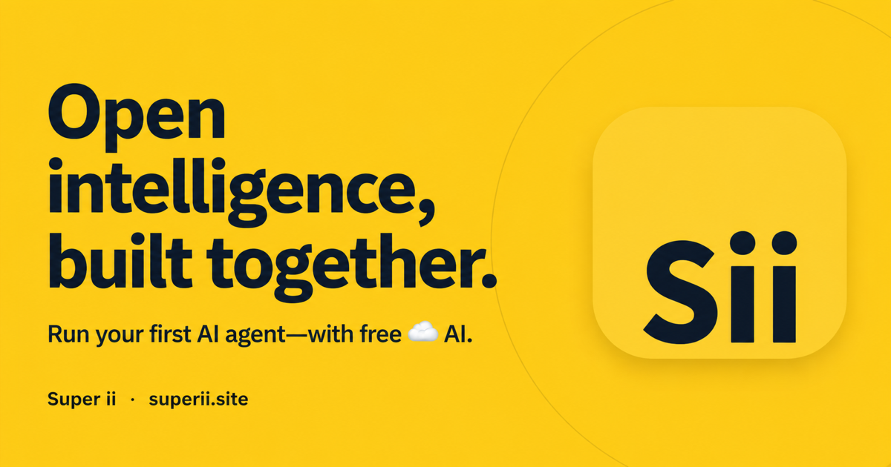
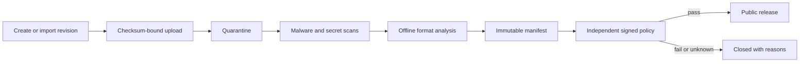
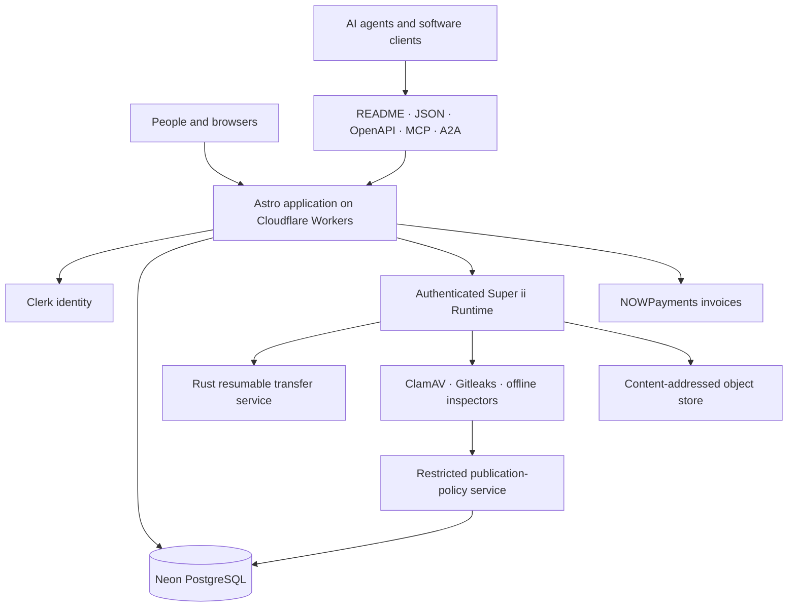

<p align="center">
  <a href="https://www.superii.site">
    
  </a>
</p>

<h1 align="center">Super ii</h1>

<p align="center">
  <strong>A public, agent-native collaboration hub for AI models, datasets, apps, people, and organizations.</strong><br />
  Discover verified work, publish through a fail-closed trust path, or connect an AI agent with bounded authority.
</p>

<p align="center">
  <a href="https://www.superii.site"></a>
  <a href="https://github.com/smavgs/super-ii/actions/workflows/ci.yml"></a>
  <a href="https://pypi.org/project/superii-sdk/"></a>
  <a href="LICENSE"></a>
</p>

<p align="center">
  <a href="https://www.superii.site/models">Models</a> ·
  <a href="https://www.superii.site/datasets">Datasets</a> ·
  <a href="https://www.superii.site/spaces">Apps</a> ·
  <a href="https://www.superii.site/builders">Builders</a> ·
  <a href="https://www.superii.site/docs">Docs</a> ·
  <a href="https://www.superii.site/siiwebskill.md">Agent guide</a>
</p>

## Start here

| I want to… | Path |
| --- | --- |
| Explore public AI work | Browse [models](https://www.superii.site/models), [datasets](https://www.superii.site/datasets), and [apps](https://www.superii.site/spaces). |
| Publish my work | Sign in, create a repository, upload an exact revision, declare rights and provenance, and submit it to independent automatic policy. |
| Use a model locally | Open a reviewed model and choose **Use model**, or use the [Python SDK](sdk/python/README.md). |
| Connect an AI agent | Begin with the public [agent guide](https://www.superii.site/siiwebskill.md), then issue a separately scoped credential only when governed work is needed. |
| Contribute code | Read [CONTRIBUTING.md](CONTRIBUTING.md), fork the repository, and open a signed-off pull request. |

The public catalog contains creator work only after the complete publication
path passes. It is not filled with demonstration repositories. Failed, missing,
unknown, or timed-out evidence keeps a revision private and quarantined.

## The trust path



| Super ii never | Super ii always |
| --- | --- |
| Treats a browser-supplied user ID as authority | Resolves identity and permissions server-side |
| Publishes around a missing scanner | Fails closed when required evidence is absent |
| Lets an agent expand its own scope | Binds credentials to exact scopes, targets, expiry, and revocation |
| Treats compatibility metadata as a benchmark | Separates declared, derived, and directly verified evidence |
| Stores wallet private keys or debits a wallet | Creates bounded invoices and waits for signed payment confirmation |
| Executes uploaded repository code during inspection | Parses supported formats offline before publication |

## Architecture



- **Control plane:** Astro server routes and the public UI on Cloudflare Workers.
- **Database:** PostgreSQL stores repository history, manifests, evidence,
  discovery, organizations, community, agent authority, and immutable receipts.
- **Data plane:** the separately authenticated runtime handles files, scanning,
  offline analysis, local inference, reviewed notebook execution, and isolated
  Gradio apps.
- **Trust root:** the publication service evaluates one immutable candidate and
  signs the exact decision with a private key that never enters this repository.

## Production stack

Every requested language has a real production responsibility:

| Language | Responsibility |
| --- | --- |
| TypeScript | Astro pages, Cloudflare server routes, database types, authentication and authorization |
| Astro | Server-rendered application shell and public content |
| CSS | Responsive design system, accessibility, and light/dark themes |
| Python | Runtime, offline inspection, policy, migrations, validation, SDK, and recipes |
| PL/pgSQL | Schema functions, integrity constraints, rate limiting, receipts, and transactional publication |
| JavaScript | Progressive enhancement, localization, interaction, and release checks |
| Shell | Reproducible check, build, runtime, and deploy pipelines |
| Go | Independent release-contract and supplied-logo verification |
| Rust | Resumable transfer service, artifact CLI, and guarded agent connector |

Cloudflare, Clerk, Neon, NOWPayments, OpenRouter, Hugging Face, Docker, ClamAV,
Gitleaks, llama.cpp, Diffusers, Gradio, Transformers.js, Ollama, and MLX are
integrations or runtime boundaries, not hidden client-side credentials. Paid or
metered services are not represented as free infrastructure.

## Python SDK

Install `superii-sdk` on Python 3.11 or newer. The import and CLI are `superii`.

```sh
python -m pip install superii-sdk
superii inspect smavgs/minicpm-v4.6-q4-k-m-verified-ollama
```

```python
import superii

plan = superii.plan("smavgs/minicpm-v4.6-q4-k-m-verified-ollama")
print(plan)

with superii.load("smavgs/minicpm-v4.6-q4-k-m-verified-ollama") as model:
    print(model.generate("Hello", max_tokens=128))
```

The SDK resolves one published commit, selects compatible files, verifies every
SHA-256 and the signed publication evidence, checks available memory, and then
invokes an explicitly installed local runtime. See the complete
[SDK guide](sdk/python/README.md).

## Agent-native surface

- `/mcp` exposes bounded read-only public discovery and repository tools.
- `/mcp/work` uses separately issued hash-at-rest credentials for repository,
  upload, submission, job, event, and receipt actions.
- `/mcp/social` and `/mcp/commerce` use different credentials and cannot inherit
  repository, account, payment, or organization authority.
- A2A v1.0 provides immediate bounded tasks; unsupported streaming or callback
  behavior is not advertised.
- GitHub trusted publishing exchanges exact OIDC claims for a short-lived,
  repository-bound token. Permanent upload credentials are not required.
- Every reviewed public repository has stable HTML, Markdown, JSON, README,
  `agents.md`, manifest, API, and MCP representations.

See [`SYSTEM-STATE.md`](SYSTEM-STATE.md) for the canonical evidence register and
[`docs/architecture/agent-commerce.md`](docs/architecture/agent-commerce.md) for
the separate bounded-commerce design.

## Local development

Prerequisites for the complete path are Node.js 24, Python 3.12 with `uv`, Go
1.26, Rust 1.97, Docker, and PostgreSQL 17.

```sh
npm ci
npm run check
npm run validate
npm run db:check
npm run db:test
npm run runtime:verify
npm run build
npm run dev
```

Copy `.env.example` to `.env` only for local server integrations. Copy
`runtime/.env.example` only on a trusted runtime host. Never commit credentials.
The complete production build temporarily removes `.dev.vars`, rejects local
metadata, and scans the release tree for configured private values.

Database migrations live in `database/migrations/` and are applied in lexical
order. Runtime and deployment operations are documented in
[`runtime/README.md`](runtime/README.md). Do not run deployment, migration,
payment, or publication commands from an unreviewed fork.

## Product languages

English is canonical. The complete human-facing product also has a Russian
edition under `/ru`. Public machine contracts remain stable English interfaces,
and user-published content remains in its source language.

## Security and evidence

- Report vulnerabilities privately under [SECURITY.md](SECURITY.md).
- Security-sensitive code changes require code-owner review and required CI.
- Secret scanning, dependency auditing, CodeQL, database integration tests,
  runtime tests, security-header checks, and production build checks run in the
  governed release path.
- Successful execution proves that exact path and evidence—not model quality,
  production throughput, universal hardware support, or legal sufficiency.
- Hostile multi-tenant compute, a managed GPU cloud, and any capability marked
  deferred in `SYSTEM-STATE.md` must not be inferred from implemented code.

## Community and governance

Read [CONTRIBUTING.md](CONTRIBUTING.md), [GOVERNANCE.md](GOVERNANCE.md), and
[CODE_OF_CONDUCT.md](CODE_OF_CONDUCT.md) before contributing. New contributors
use forks and reviewed pull requests; source access never grants production or
release authority.

## License and marks

Code is available under the [Super ii Modified MIT License](LICENSE), including
its commercial attribution condition. It is a custom license, not the
unmodified MIT License. The Super ii name and logo are governed separately by
[TRADEMARKS.md](TRADEMARKS.md). Vendored assets and compatibility marks are
recorded in [THIRD_PARTY_NOTICES.md](THIRD_PARTY_NOTICES.md).
